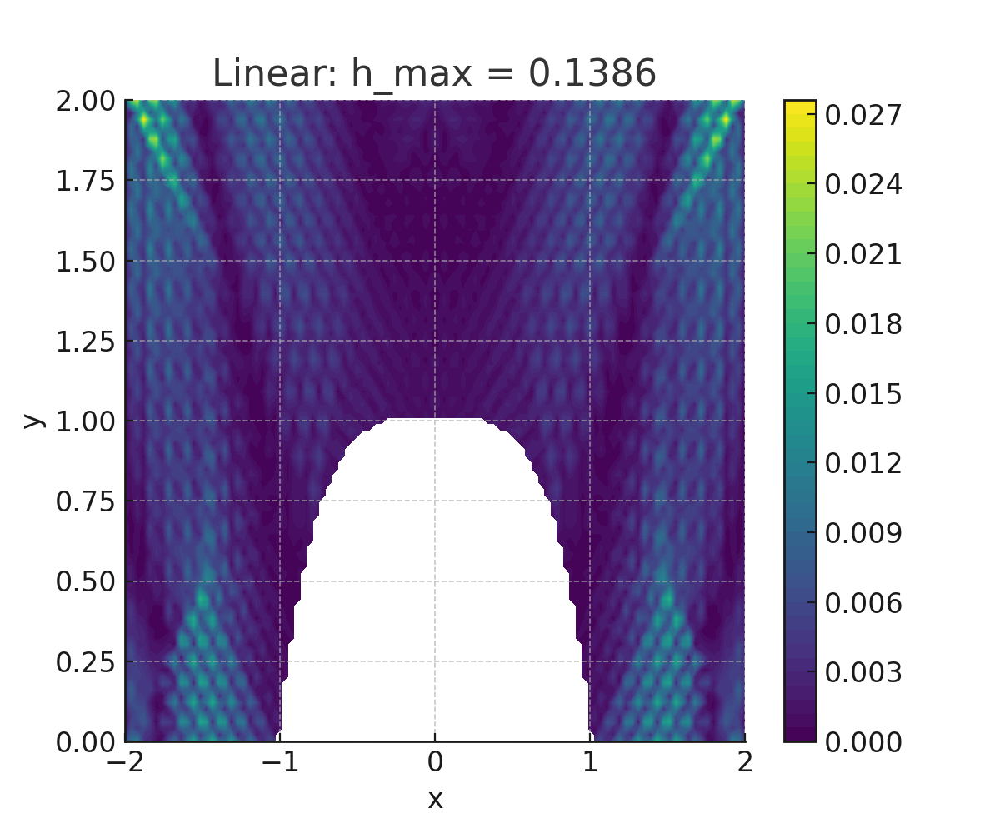
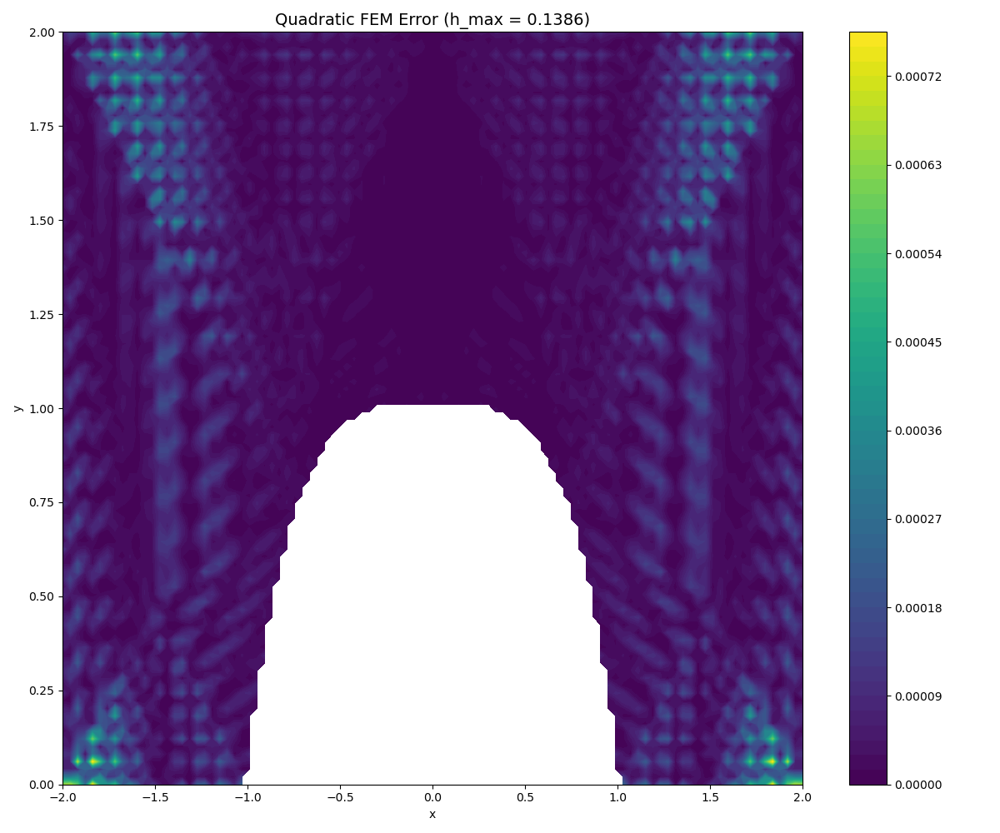

# 🧮 2D Finite Element Solver for Elliptic BVP

This project implements a 2D finite element method (FEM) solver for solving an elliptic boundary value problem (BVP):

**PDE:**  
  −∇ · (k(x, y) ∇u) = f(x, y) in domain Ω  
with mixed **Dirichlet** and **Neumann** boundary conditions.

---

## 📘 Problem Description

We solve the equation:  
  −∇ · (k(x, y) ∇u) = f(x, y) in domain Ω   
with exact solution:  
  u(x, y) = sin(y - x²)

**Domain:**  
  Ω = { (x, y) | -2 < x < 2, 0 < y < 2 } \ { y ≤ 1 - x⁴ }

**Boundary Conditions:**
- Dirichlet (Γ₁): u = sin(1 - x² - x⁴)
- Neumann (Γ₂): derived from k * ∂u/∂n

---

## 🔧 Methodology

- Linear (P1) and Quadratic (P2) shape functions
- Adaptive mesh refinement until max triangle edge length h_max ≤ target
- Gaussian quadrature for assembling stiffness matrix and load vector
- Sparse matrix solution with SciPy’s `spsolve`
- Error evaluated in both L2 and H1 norms

---

## 📊 Results

### 🔹 Error Distribution (Linear, h_max = 0.25)



### 🔸 Error Distribution (Quadratic, h_max = 0.25)



> ✅ **Observation**: Quadratic shape functions yield significantly lower error and smoother error profiles, especially near the Dirichlet boundary.

---

## 📈 Convergence Rates

| h_max   | L2-norm (Linear) | H1-norm (Linear) | L2-norm (Quadratic) | H1-norm (Quadratic) |
|--------:|------------------:|------------------:|----------------------:|----------------------:|
| 1.1086  | 5.31e-1           | 2.82e+0           | 7.28e-2               | 8.42e-1               |
| 0.5543  | 1.74e-1           | 1.57e+0           | 1.11e-2               | 2.64e-1               |
| 0.2772  | 4.70e-2           | 8.13e-1           | 1.42e-3               | 6.82e-2               |
| 0.1386  | 1.20e-2           | 4.10e-1           | 1.82e-4               | 1.74e-2               |

### 🔍 Observed Convergence Orders

| Element Type | L2 Order | H1 Order |
|--------------|----------|----------|
| Linear       | 1.83     | 0.93     |
| Quadratic    | 2.89     | 1.87     |

---

## 📁 Project Structure

```
.
├── myFE1dibvp.py         # FEM solver with mesh refinement and assembly
├── fn.py                 # FEM utility functions (shape functions, quadrature, etc.)
├── report.pdf            # Mathematical derivation and explanation
├── initial_triangulation.npz
├── linear_hmax_*.png     # Error plots (linear)
├── quadratic_hmax_*.png  # Error plots (quadratic)
└── README.md             # This file
```

---

## 🧠 Key Insights

- Mesh refinement reduces global error, but singularities (corners) still dominate.
- Quadratic elements converge faster and are significantly more accurate.
- Results closely match theoretical convergence orders for both L2 and H1 norms.
